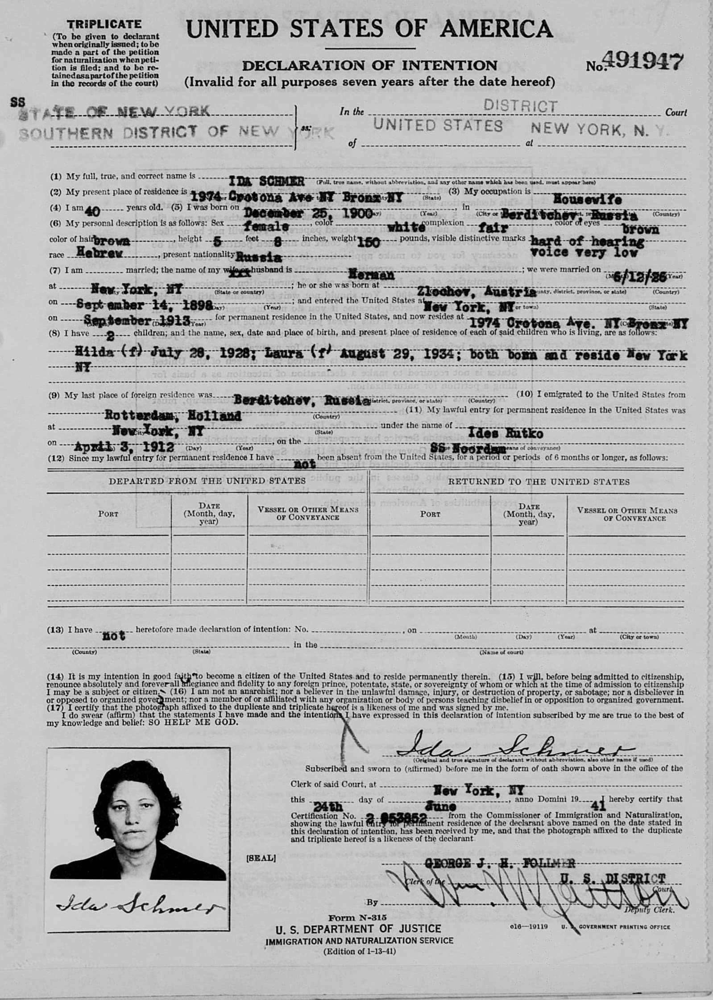

# Hilda-s-Archive- 
## An archive of Hilda Kalish's papers, including government documents, personal correspondence, family photos, and educational milestones. 
Hilda Kalish (b. 1928, New York City) maiden name Schmer, was the daughter of Russian Jewish immigrants, Ida Schmer and Herman Schmer. She was born and raised in the Bronx in New York City, where she met and married Phillip Kalish (b. 1930). Hilda and Phillip married shortly after meeting as teenagers, and had three children, with whom they travelled the United States, living in New Mexico, Colorado, Missouri, Washington, and California. Hilda held many professions throughout her life. After briefly attending the Art Students League as a teenager in the 1930s and early 1940s, she held a variety of jobs including working as a cartographer, kitchen designer, and art teacher. In her retirement, Hilda served as a docent at the Seattle Art Museum before retiring in La Jolla, California, where she served as the community art writer and critic for the residents exhibitions. 

